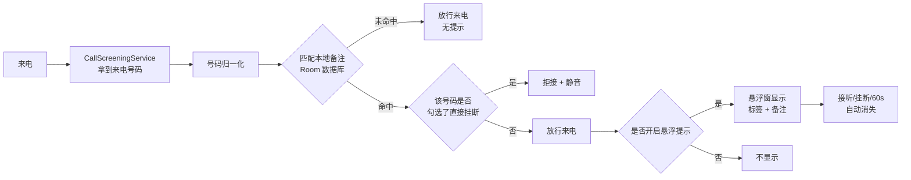

# 本地来电备注（LocalCallNote）

> 给那些「有必要知道是谁、但不想存进通讯录」的号码做本地标记；下次来电时，一块悬浮提示告诉你这是谁、上回说了什么。


---

## 目录

- [为什么需要它](#为什么需要它)
- [使用场景演示](#使用场景演示)
- [功能](#功能)
- [来电悬浮提示](#来电悬浮提示)
- [工作原理](#工作原理)
- [安装](#安装)
- [首次使用：开启权限](#首次使用开启权限)
- [权限与隐私](#权限与隐私)
- [国产 Android 系统兼容](#国产-android-系统兼容)
- [备份文件格式](#备份文件格式)
- [技术栈](#技术栈)
- [项目结构](#项目结构)
- [已知限制](#已知限制)
- [常见问题](#常见问题)
- [参与贡献](#参与贡献)
- [许可证](#许可证)

---

## 为什么需要它

有一类号码，你**有必要记住它是谁**，但**并不想为它添加一个联系人**：

- 京东快递员打来：「到楼下了，方便下来取一下吗？」
- 顺丰快递员打来：你想直接说「放小区驿站就行」。
- 家里那家常用快递的快递员打来：你想直接说「送到公司前台」。
- 装修师傅、门店售后、中介、临时对接的维修工……

这些号码只存在几个月，会换人、会换号，而且你真的不需要它们出现在通讯录里——联系人列表会被污染，还可能被同步到各种账号和云服务上。

现有方案各有各的别扭：

| 方案 | 问题 |
| --- | --- |
| 存进系统通讯录 | 污染联系人列表、可能被云同步、换人换号后要手动清理 |
| 云端号码库 / 来电秀类 App | 只能识别「顺丰官方客服」这类公开号码，识别不了「我家这个快递员」；还要联网、上传通话行为 |
| 靠脑子记 | 换个号码就不认得了 |

**本项目的定位：只做「本地号码备注」这一件事。**

标记只写在你自己的手机上，不联网、不上传、不写系统通讯录、不做云端号码识别。它也不是骚扰拦截软件——它不是用来判断「这个号码该不该接」，而是用来提醒你「这个号码是谁」。

---

## 使用场景演示

**第一次**：顺丰快递员 `138****8000` 打来 → 接完，在「通话」页点这个号码 → 填标签「顺丰快递」、备注「放小区驿站」→ 保存。

**第二次**：同一个号码再次打来，电话还没接起来，屏幕中央已经弹出提示：

```text
┌──────────────────────────────────┐
│  顺丰快递                         │
│  放小区驿站                       │
│  快递 · 普通                      │
│                    关闭  编辑备注 │
└──────────────────────────────────┘
```

于是你可以直接接起来说「放小区驿站就行」，不用先花三秒钟想「这谁来着」。

常见用法参考：

| 来电者 | 标签 | 备注 | 接听后可以直接说 |
| --- | --- | --- | --- |
| 顺丰快递员 | 顺丰快递 | 放小区驿站 | 「放驿站就行」 |
| 京东快递员 | 京东快递 | 送到公司前台 | 「送公司前台」 |
| 家附近的快递员 | 小区快递 | 晚 7 点后才有人 | 「7 点后再送」 |
| 门店售后 | 华为售后 | 耳机保修内，返厂中 | 「保修进度查一下」 |
| 装修/维修师傅 | 装修李师傅 | 阳台漏水，报价等回复 | 「今天能过来吗」 |

---

## 功能

- **通话记录列表**：读取本机最近通话记录，下拉刷新，支持按号码 / 标签 / 备注内容搜索。
- **本地备注**：为任意号码添加「标签 + 详细备注 + 分类 + 重要程度」，随时编辑、删除。
- **来电悬浮提示**：来电时按号码匹配本地备注，用一块轻量悬浮卡片显示「谁 + 上次说了什么」。
- **号码归一化匹配**：`13800138000`、`+86 138 0013 8000`、`008613800138000` 会识别为同一个号码；匹配不到时再按后 11 位兜底匹配。
- **分类与重要程度**：内置快递 / 门店 / 售后 / 维修 / 中介 / 客服 / 临时联系人 / 其他，可自行增删改；重要程度分普通 / 重要 / 谨慎接听。
- **可选：来电直接挂断**：针对个别号码（例如反复骚扰的推销号）可单独勾选拒接，只对该号码生效。
- **备份与恢复**：一键导出 / 导入 JSON 备份文件，卸载重装或换机后可以找回备注。
- **全本地存储**：Room 数据库，没有任何网络代码。

界面分三个 Tab：**通话**（从通话记录挑号码加备注）、**备注**（管理已标记的号码）、**设置**（权限、分类、备份）。

---

## 来电悬浮提示

这是整个 App 最有用的部分，实现上有几个刻意的取舍：

**显示方式**

- 通过 `SYSTEM_ALERT_WINDOW` 权限在来电界面上层绘制悬浮卡片，居中显示，宽度为 `min(屏宽 - 48dp, 420dp)`。
- 卡片深色半透明（`#1C1F24`，约 95% 不透明度）、圆角 18dp，标题 24sp 加粗白字，正文最多 3 行。
- 使用 `FLAG_NOT_FOCUSABLE`，**不抢焦点、不拦截触摸**：底下的系统来电界面照常可以接听 / 挂断。
- 不会覆盖或替换系统来电界面，只是在上面叠一层提示，所以「接听」「挂断」永远还是系统那一套。

**什么时候消失**

- 接听（`OFFHOOK`）或挂断（`IDLE`）时自动消失；通过电话状态广播 + 每秒轮询双保险，部分 ROM 广播不可靠时靠轮询兜底。
- 最长显示 60 秒后自动消失。
- 点击卡片任意位置立即关闭；点击右下角可跳到备注编辑页直接改内容。

**降级策略**

如果悬浮窗权限没给、或者悬浮窗被系统拒绝（锁屏场景下部分 ROM 会禁止第三方悬浮窗），会自动降级成一条高优先级通知，通知内容同样是「标签 + 备注」，点开即进入编辑页。锁屏来电时会同时发一条降级通知，避免信息完全看不到。

**单个号码可关闭**

每个备注都可以单独关掉「来电时显示悬浮提示」，适合那种「只想记一下，但不想每次来电都被弹一下」的号码。

---

## 工作原理



关键点：

- 使用 `CallScreeningService`（而不是默认电话 App、也不是无障碍服务）获取来电号码，这是 Android 官方为「来电识别」提供的入口。
- 默认行为是**完全放行**：`setDisallowCall(false)`、`setRejectCall(false)`、`setSilenceCall(false)`，因此不勾选「直接挂断」的号码，行为与没装本 App 完全一致。
- 号码查询带 1.2 秒超时保护，数据库异常或超时不会卡住来电流程。

---

## 安装

### 方式一：下载 APK

到 Releases 页面（`https://github.com/<你的用户名>/<仓库名>/releases`）下载最新 APK，在手机上安装（需要允许「安装未知来源应用」）。

> 通话记录权限属于敏感权限，本 App 只适合自行编译或从 Releases 侧载安装，不适合直接上架 Google Play。

### 方式二：自行编译

环境要求：

| 项目 | 版本 |
| --- | --- |
| JDK | 17 或更高 |
| Android SDK Platform | 36（`compileSdk = 36`） |
| Android Studio | Ladybug 或更新（可选，命令行也可构建） |
| Gradle | 8.11.1（已包含 wrapper，无需手动安装） |

```bash
git clone https://github.com/<你的用户名>/<仓库名>.git
cd <仓库名>

# 指定 Android SDK 路径；用 Android Studio 打开时会自动生成，命令行构建需要手动写
echo "sdk.dir=$HOME/Android/Sdk" > local.properties

# 构建 Debug APK
./gradlew assembleDebug
# 产物：app/build/outputs/apk/debug/app-debug.apk

# 跑单元测试（号码归一化规则）
./gradlew test
```

Windows 用户把 `./gradlew` 换成 `gradlew.bat`，`local.properties` 里的路径需要转义反斜杠，例如：

```properties
sdk.dir=C\:\\Users\\你的用户名\\AppData\\Local\\Android\\Sdk
```

Release 构建：仓库内未提供签名配置，`./gradlew assembleRelease` 产出的是未签名 APK，正式分发前请在 `app/build.gradle.kts` 中补上 `signingConfigs`，或用 `apksigner` 手动签名。

---

## 首次使用：开启权限

装完打开 App，进入「设置」页，按顺序开启四项：

| 步骤 | 项目 | 作用 | 不开启的后果 |
| --- | --- | --- | --- |
| 1 | 通话记录权限 | 读取最近通话，方便直接从通话记录加备注 | 「通话」页为空 |
| 2 | 电话状态权限 | 接听 / 挂断时自动关掉悬浮提示 | 悬浮卡片依赖 60 秒超时消失 |
| 3 | 来电识别服务（`ROLE_CALL_SCREENING`） | 来电时获取号码并匹配备注 | **来电提示完全不可用** |
| 4 | 悬浮窗权限 | 在来电界面上层显示备注卡片 | 降级为通知提醒 |

第 3 步会弹出系统对话框，把「来电识别」角色授予本 App。这个角色的作用是**拿到来电号码**，本 App 不会拦截、不会拒接、不会静音任何来电（除非你在某个备注上主动勾选了「来电直接挂断」）。拒绝该角色后，通话记录与备注管理功能仍然可以正常使用。

---

## 权限与隐私

### 申请的权限

| 权限 | 用途 | 说明 |
| --- | --- | --- |
| `READ_CALL_LOG` | 读取最近通话记录 | 仅用于在 App 内展示，供你挑选号码加备注 |
| `READ_PHONE_STATE` | 感知通话状态 | 通话接听 / 挂断时关闭悬浮提示 |
| `SYSTEM_ALERT_WINDOW` | 显示来电悬浮提示 | 仅在来电时使用，不常驻 |
| `POST_NOTIFICATIONS` | 悬浮窗不可用时的通知降级 | Android 13+ 需要单独授权 |
| `BIND_SCREENING_SERVICE` | 系统绑定来电筛选服务 | 由系统声明，App 不申请，仅用于被系统调用 |

### 隐私承诺

- 所有号码备注仅保存在本机 Room 数据库中。
- **不上传**通话记录，**不上传**电话号码，**不上传**任何备注内容。
- **不读取**短信，**不读取**系统联系人。
- **不写入**系统通讯录——这是本项目的核心设计目标。
- **不做**云端号码识别、不做骚扰号码库比对。
- 项目代码中没有网络访问逻辑，可在源码中自行核对。
- 卸载 App 后本地备注会随应用数据一并删除，需要保留请提前「导出 JSON」。

---

## 国产 Android 系统兼容

MIUI / 澎湃 OS、ColorOS、OriginOS、HarmonyOS / MagicOS 等系统对后台运行、自启动和悬浮窗有额外限制。如果来电时没有提示，请额外检查：

- 系统设置中允许本 App「**后台弹出界面**」（部分 ROM 的关键开关，不开启悬浮窗会被静默拦截）。
- 允许「自启动」和「后台运行」，并把省电策略设为「无限制」。
- 确认「来电识别」角色没有被系统或其它 App（如某些安全中心）抢走。
- 锁屏来电时，部分 ROM 完全禁止第三方悬浮窗，此时只能看到降级通知。

---

## 备份文件格式

「设置 → 备份与恢复 → 导出 JSON」会生成如下结构（`BackupJson.export`）：

```json
{
  "version": 1,
  "exportedAt": 1748000000000,
  "app": "LocalCallNote",
  "notes": [
    {
      "rawNumber": "13800138000",
      "normalizedNumber": "+8613800138000",
      "last11Digits": "13800138000",
      "displayLabel": "顺丰快递",
      "note": "放小区驿站",
      "category": "EXPRESS",
      "importance": "NORMAL",
      "enableIncomingPopup": true,
      "rejectIncomingCall": false,
      "createdAt": 1748000000000,
      "updatedAt": 1748000000000
    }
  ]
}
```

导入采用按 `normalizedNumber` 覆盖的策略：同号码会更新而不是新增。你完全可以手写这个 JSON 来批量导入备注。

---

## 技术栈

| 分类 | 选型 |
| --- | --- |
| 语言 | Kotlin 2.0.21 |
| UI | Jetpack Compose（BOM 2024.09.00）+ Material 3 |
| 导航 | Navigation Compose 2.8.4 |
| 存储 | Room 2.6.1（KSP 注解处理） |
| 异步 | Kotlin Coroutines / Flow |
| 构建 | AGP 8.10.1 + Gradle 8.11.1 |
| 架构 | 单 Activity + Compose Navigation + ViewModel + Repository + Room |
| SDK | `minSdk 29` / `targetSdk 35` / `compileSdk 36` |

没有引入任何第三方 SDK、统计埋点或广告库，依赖全部来自 AndroidX。

---

## 项目结构

```text
app/src/main/java/com/lyx/phone/note/
├── MainActivity.kt                  # 单 Activity + 导航 + 备份导入导出入口
├── LocalCallNoteApp.kt              # Application，持有数据库与 Repository
├── backup/BackupJson.kt             # JSON 备份的导出与解析
├── data/
│   ├── calllog/                     # 系统通话记录读取
│   ├── db/                          # Room 实体、DAO、数据库
│   └── repository/                  # 备注与分类的 Repository
├── domain/
│   ├── PhoneNumberNormalizer.kt     # 号码归一化与脱敏（含单元测试）
│   ├── NoteCategory.kt              # 内置分类
│   └── NoteImportance.kt            # 重要程度
├── overlay/IncomingOverlayController.kt  # 来电悬浮卡片 + 通知降级
├── permission/                      # 权限 / 角色状态检查与申请
├── telecom/LocalCallScreeningService.kt  # 来电筛选服务
└── ui/                              # 通话记录、备注、编辑、分类、设置各页面
```

---

## 已知限制

- **锁屏来电**：部分 ROM 会禁止第三方悬浮窗，锁屏时只能看到降级通知。
- **悬浮卡片误触**：卡片右下角的「关闭 / 编辑备注」在实现上是一段可点击文本，点在「关闭」上也会跳到编辑页，后续会拆成两个独立按钮。
- **导入策略单一**：目前只有「按号码覆盖」，尚未提供跳过 / 合并选项。
- **归档未开放**：数据库已保留 `isArchived` 字段和归档方法，但界面暂未提供入口。
- **Google Play**：`READ_CALL_LOG` 属敏感权限，如需上架需重新评估合规方案（例如改用默认电话 App 角色）。
- **release 未配置签名**：需要自行补充 `signingConfigs`。
- **应用内暂未内置语言切换**：界面文案为中文硬编码。

---

## 常见问题

**Q：会不会影响正常接电话？**

不会。默认行为是放行（不拦截、不静音、不改变通话记录和通知），只是额外叠一层提示。只有你对某个号码主动勾选了「来电直接挂断」，该号码来电才会被拒接。

**Q：和系统自带的「骚扰拦截 / 号码标记」有什么区别？**

系统的号码标记基于云端号码库，只能告诉你「这是顺丰客服」；本 App 标记的是你自己的私人信息——「这个号码是我家楼下那个快递员，让他放驿站」。两者解决的不是同一个问题。

**Q：为什么不用通讯录？**

因为通讯录是「长期存在的联系人」，而这些号码是「临时的对接人」。混在一起会让联系人列表越来越乱，还可能被云同步到你不希望的地方。

**Q：数据会上传吗？**

不会。没有任何网络请求代码，所有数据都在本机 Room 数据库里。

**Q：换手机怎么迁移？**

在旧手机「设置 → 导出 JSON」，把文件传到新手机后用「导入 JSON」恢复。

---

## 参与贡献

欢迎 Issue 和 PR，尤其是这几类：

- 国产 ROM 的悬浮窗 / 来电识别兼容性反馈（请注明机型与系统版本）。
- 号码归一化规则的补充（目前在 `PhoneNumberNormalizer` 中，配套单元测试在 `app/src/test/`）。
- 界面与交互改进。

提交前请确保 `./gradlew test` 通过。出于隐私考虑，提 Issue 时请勿粘贴真实号码，用 `138****8000` 即可。

---

## 许可证

本项目采用 [MIT License](LICENSE)。

---

## 免责声明

本 App 仅用于个人本机号码备注。请勿用于窃取他人通话信息、骚扰拦截绕过或其他违法用途。使用「来电直接挂断」功能时，也请注意避免误拒重要来电。
